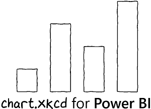

* [Overview](#overview)
* [What the Custom Visual Does](#what-the-custom-visual-does)
* [Installing the Visual](#installing-the-visual)
* [Using the Visual](#using-the-visual)
* [Support](#support)
* [Privacy Policy](#privacy-policy)

# Overview

In August 2019, Tim Qian released [chart.xkcd](https://github.com/timqian/chart.xkcd), which is a JavaScript library that provides a means to plot *“sketchy”, “cartoony” or “hand-drawn” styled charts*.

This allows developers to use [JSON](https://www.json.org/) as a type of *"visualisation grammar"* to configure charts and then chart.xkcd will use this generate charts.

Being the enquiring sort that I am, I wondered, "can we put this in a custom visual..?"

Turns out we can. Should we? That's up to you!

# What the Custom Visual Does

* Provides feature parity with chart.xkcd version **1.0.10**. Including all bugs. chart.xkcd is in its early stages and a lot of things are still being worked out. Don't let that discourage you. It's great, and data can be fun as well as educational :)
* Provides the Power BI user with access to all functionality via the properties pane and the right combination of fields.
* Probably has lots of bugs. Refer to [Support](#support) below for further details.

# Installing the Visual

Due to the high-cadence of chart.xkcd's development and the somewhat experimental nature of the custom visual, the release and testing process employed by the AppSource Marketplace and the Power BI Custom Visuals team means that several releases may be available before an update gets published. If things stabilise in the future then this stance may change.

For now, you can download and install releases from this repository. You need to either [install the `.pbiviz` file manually](https://docs.microsoft.com/en-us/power-bi/power-bi-custom-visuals#import-a-custom-visual-from-a-file) into your reports, or you can use the [organizational custom visuals capabilities of your tenant](https://docs.microsoft.com/en-us/power-bi/power-bi-custom-visuals-organization) if you wish to inflict this on everyone. You might really want to rethink this option if it seems like a good idea.

| Version | Direct Download | Release Notes |
|---------|-----------------|---------------|
| 1.0.0.0 | [1.0.0.0.pbiviz](https://github.com/dm-p/powerbi-visuals-chartxkcd/releases/download/1.0.0.0/chartXkcd32FC84B3628540DDAA713E329738A6A0.1.0.0.0.pbiviz) | [Read more](https://github.com/dm-p/powerbi-visuals-chartxkcd/releases/tag/1.0.0.0) |

# Using the Visual

As at this time the visual supports all types available in version 1.0.10 of chart.xkcd and their exposed properties. The visual exposes 3 property menus:

* **Core Parameters** - allows selection of chart type and setting of parameters in the chart.xkcd spec that sit outside the chart-specific options.
* **Chart Options** - provides properties that drive the chart-specific options.
* **About** - provides version info (+ version of chart.xkcd packaged with the visual)

## Supported Chart Types

Select the **Chart Type** from the **Core Parameters** property menu. Supported charts are:

* [Bar Chart](https://timqian.com/chart.xkcd/#bar_chart)
* [Pie/Donut Chart](https://timqian.com/chart.xkcd/#pie_doughnut_chart)
* [Line Chart](https://timqian.com/chart.xkcd/#line_chart)
* [XY Chart](https://timqian.com/chart.xkcd/#xy_chart)

## Data Roles (Fields)

The visual has 3 data roles (field "buckets"). Because each chart type has specific behaviour, the visual provides a "best-fit" for each configuration and each chart type will document the "correct" usage of these to produce desired results. A rule-of-thumb is as follows:

* **Category (or X)** - synonymous with the `data.labels` part of the chart.xkcd specification, or the `x` attribute of the XY chart.
* **Measures (or Y)** - synonymous with the `data` attribute of the `dataset` object. Effectively the Y-Axis for a cartesian chart or the share of the Pie/Donut chart. 
* **Legend (Series)** - synonymous with the `data` attribute of the `dataset` object.

If the selected **Chart Type** doesn't support the combination of fields, you *should* get a message confirming this. If you don't get a chart *or* a message then you've found a bug!

Here are the valid combinations of data roles for each chart type:

| Category | Measures  | Series | Bar   | Pie   | Line  | XY   |
|----------|-----------|--------|:-----:|:-----:|:-----:|:----:|
| 1        | 1         | 0      | ✔️    | ✔️   | ✔️   | ✔️*  |
| 1        | 1         | 1      | ❌    | ❌   | ✔️   | ✔️*  |
| 1        | 1 or more | 0      | ❌    | ❌   | ✔️   | ❌   |

\* For the XY chart, the **Category** must be defined in the Power BI data model as numeric or date/time.

## Core Parameters

Core Parameters properties will be available as follows:

| Property   | Purpose                                                  | Bar   | Pie/Donut   | Line   | XY   |
|------------|----------------------------------------------------------|:-----:|:-----------:|:------:|:----:|
| Show Title | Allows user to specify title, using chart.xkcd font      |  ✔️   | ✔️         | ✔️     | ✔️  |
| Title      | Title text (available if **Show Title** enabled)         |  ✔️   | ✔️         | ✔️     | ✔️  |
| X-Label    | Label for X-Axis. Defaults to **Category** if empty      |  ✔️   | ❌         | ✔️     | ✔️  |
| Y-Label    | Label for Y-Axis. Defaults to first **Measure** if empty |  ✔️   | ❌         | ✔️     | ✔️  |

## Chart Options

Chart Options properties will be available as follows:

| Property        | Purpose                                                                                                                                                                                    | Bar   | Pie/Donut   | Line   | XY   |
|-----------------|--------------------------------------------------------------------------------------------------------------------------------------------------------------------------------------------|:-----:|:-----------:|:------:|:----:|
| X Tick Count    | The number of ticks to display on the x-axis.                                                                                                                                              | ❌    | ❌         | ❌     | ✔️  |
| Y Tick Count    | The number of ticks to display on the y-axis.                                                                                                                                              | ✔️    | ❌         | ️️✔️     | ✔️  |
| Legend Position | Specifies where to place the legend.                                                                                                                                                       | ❌    | ️️✔️         | ✔️     | ✔️  |
| Show Line       | Specifies whether lines should be connected with a line.                                                                                                                                   | ❌    | ❌         | ❌     | ✔️  |
| Time Format     | When the Category is Date/Time, you can provide use a [valid dayjs format specification](https://github.com/iamkun/dayjs/blob/dev/docs/en/Plugin.md#customparseformat) to format the axis. | ❌    | ❌         | ❌     | ✔️  |
| Dot Size        | Specifies size of the dots in the XY plot.                                                                                                                                                 | ❌    | ❌         | ❌     | ✔️  |
| Inner Radius    | The radius of the chart (in %). Set this to 0% for a pie chart.                                                                                                                            | ❌    | ✔️         | ❌     | ❌  |

# Support

The visual is an MIT-licensed open source project, provided "as-is" and funded entirely by my free time and my enthusiasm. 

chart.xkcd is similarly-licensed and run, although [Tim has a Patreon](https://www.patreon.com/timqian) if you appreciate his work and want to support the development of chart.xkcd.

If there are bugs, then it's a good question as to whether they exist in chart.xkcd, or this custom visual's ability to drive it. Feel free to create issues and I will investigate when I can, advise accordingly (and possibly pass over the fence to the chart.xkcd project if needed).

This was an exercise for me in how the custom visual framework can drive another charting library, and there's some fun stuff going on under the hood. Some of the conditions that handle mapping into the view model are not optimal and will need to be revisited, I'm sure.

If you wish to learn more about how dataRoles and dataViewMappings work, as well as the code required to make a workable view model, then feel free to check-out, review and ask any questions. I'll do my best to answer them.

# Privacy Policy

This visual does not collect your data. Data is accessed for display purposes only.